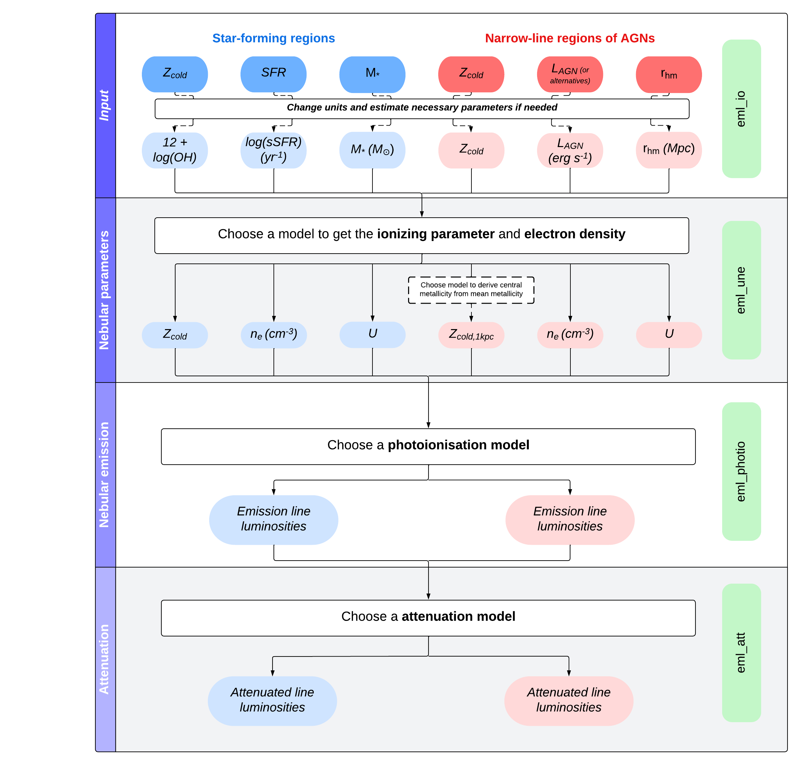

.. _features:
Code Features
=============

The main functions available in the `get_nebular_emission`_ package are
listed below in alphabetical order. The list contains the module name
followed by the function name with the expected input parameters in
brackets.

-  ``eml.eml(infile, outfile, m_sfr_z, h0=None, cutcols=[None], mincuts=[None], 
        maxcuts=[None], att_param=['Rvir','ColdGas'],
        volume = 542.16**3.,inputformat='HDF5',
        IMF_i=['Chabrier', 'Chabrier'], IMF_f=['Kroupa', 'Kroupa'], 
        attmod='cardelli89',unemod='kashino20',photmod='gutkin16',
        LC2sfr=False, cutlimits=False, mtot2mdisk = True,
        verbose=True, Plotting=False, Testing=False)``: 
   Master function of the ``get_nebular_emission`` package that
   calculate emission lines given the properties of model galaxies.
   This function follows the flow chart presented in
   :ref:`chart`.

In what follows, the above functions will be referred by simply their
name, without stating the modules they belong to.

   
.. _chart:

Flow chart
----------

Flow chart for the ``eml`` function (within the
``eml`` module) which contains all the functionality of the
`get_nebular_emission`_ package presented here.

.. _get_nebular_emission: https://github.com/galform/get_nebular_emission
